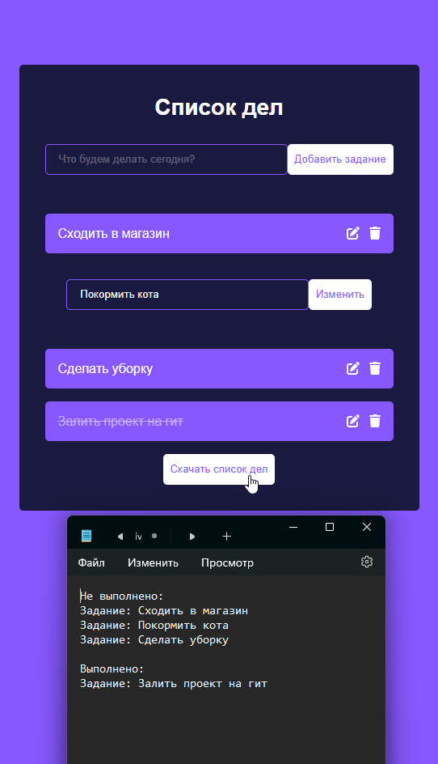

# Приложение To Do App

Порядок запуска:
- Установить зависимости (npm install)
- Запустить приложение (npm start)

Использованные технологии:
- ReactJS
- Библиотека иконок Font Awesome

Приложение позволяет:
- Создавать список дел
- Редактирование списка дел
- Создание пометки о завершенности дела
- Удаление
- Скачивание списка дел в формате .txt

# Скриншот
